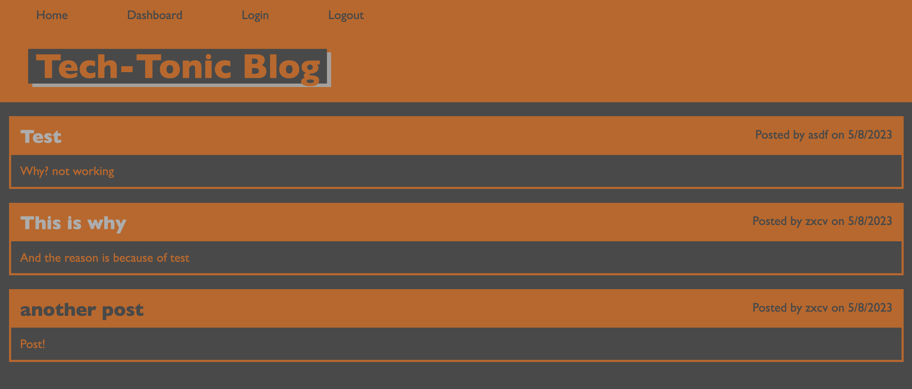
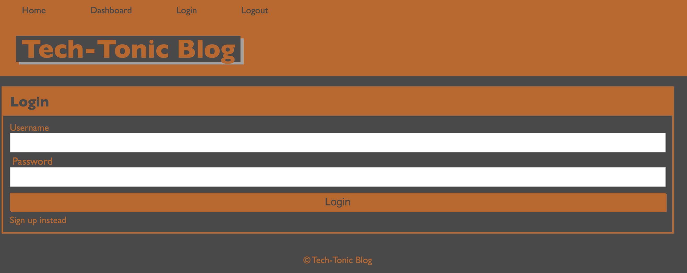

# Tech Tonic blog


## Links

[Blog deployed site](https://drive.google.com/file/d/1pPk3p78dewEXlqegHU1T5IhvrfWoZ0OO/view)

## Table of Contents

* [Description](#description)
* [Installation](#installation)
* [Code Example](#code-example)
* [Application Examples](#application-examples)
* [Usage](#usage)
* [License](#license)
* [Questions](#questions)


## Description
This is minimalistic a full stack application that allows users to sign up and create personal tech blog posts. You are able to create new blog posts and view other users blog posts as well. Viewing other users blog post allows users to comment of them if they would like. Additionally users can edit their previous posts as well.

## Installation
No installation necessary as this is a full stack application, simply visit the deployed link

## Code Example
Below is an example of code working to direct the user to their dashboard after being successfully authenticated.
```JS
// authentication for user
router.get('/', withAuth, async (req, res) => {
  try {
    const postData = await Post.findAll({
      where: {
        userId: req.session.userId,
      },
    });

    const posts = postData.map((post) => post.get({ plain: true }));
// renders all post after authentication
    res.render('all-posts-dash', {
      layout: 'dashboard',
      posts,
    });
  } catch (err) {
    res.redirect('login');
  }
});
```

## Application Examples
Bellow are a couple examples of the application when in use

The first example shows all post displayed from different users


---

This second screenshot is an example of the login section of the website



## Usage


Make sure you have followed the deployed blog link within the [links](#links) section. After following the deployed link, the user will be greeted with previous users blog post if any were created. The user can then either login or create an account following the login link at the top of the nav bar. After being successfully authenticated, the user is logged in and directed to their dashboard. From the dashboard the user can create, edit, or delete their previous posts. Additionally the user can visit other posts as well from the homepage. Finally the user can logout by either clicking the logout button from the top of the page or after 5 minutes the user will automatically be signed out.


## License
For additional information on this license please use the provided link


[MIT License](https://choosealicense.com/licenses/mit/)

## Questions
Please refer any questions to my Github

Github: [jonnyboy808](https://github.com/jonnyboy808)


